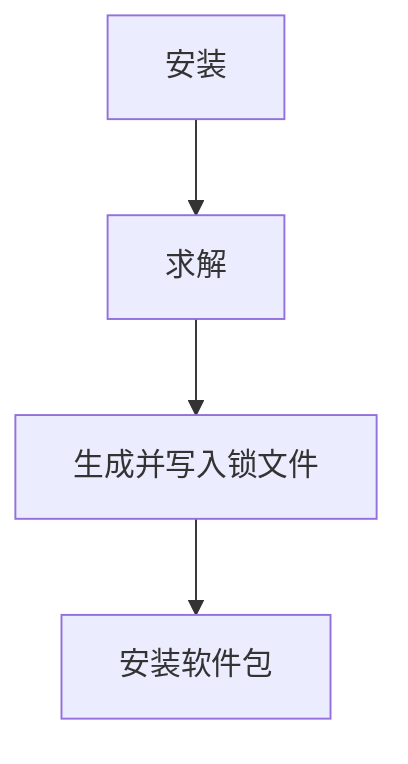

# `pixi.lock` 锁文件

> 锁文件是环境的保护者，而 pixi 是解锁它的钥匙。

## 什么是锁文件？

锁文件将环境锁定在特定的状态中。
在 pixi 中，锁文件描述了环境中的软件包。
锁文件包含两个定义：

- 项目中使用的环境及其完整的软件包集。例如：

  ```yaml
  environments:
      default:
          channels:
            - url: https://conda.anaconda.org/conda-forge/
          packages:
              linux-64:
              ...
              - conda: https://conda.anaconda.org/conda-forge/linux-64/python-3.12.2-hab00c5b_0_cpython.conda
              ...
              osx-64:
              ...
              - conda: https://conda.anaconda.org/conda-forge/osx-64/python-3.12.2-h9f0c242_0_cpython.conda
              ...
  ```

  - 软件包本身的定义。例如：

    ```yaml
    - kind: conda
      name: python
      version: 3.12.2
      build: h9f0c242_0_cpython
      subdir: osx-64
      url: https://conda.anaconda.org/conda-forge/osx-64/python-3.12.2-h9f0c242_0_cpython.conda
      sha256: 7647ac06c3798a182a4bcb1ff58864f1ef81eb3acea6971295304c23e43252fb
      md5: 0179b8007ba008cf5bec11f3b3853902
      depends:
        - bzip2 >=1.0.8,<2.0a0
        - libexpat >=2.5.0,<3.0a0
        - libffi >=3.4,<4.0a0
        - libsqlite >=3.45.1,<4.0a0
        - libzlib >=1.2.13,<1.3.0a0
        - ncurses >=6.4,<7.0a0
        - openssl >=3.2.1,<4.0a0
        - readline >=8.2,<9.0a0
        - tk >=8.6.13,<8.7.0a0
        - tzdata
        - xz >=5.2.6,<6.0a0
      constrains:
        - python_abi 3.12.* *_cp312
      license: Python-2.0
      size: 14596811
      timestamp: 1708118065292
    ```

## 为什么需要锁文件

Pixi 使用锁文件有以下几个原因：

- 保存一个工作环境的安装状态，而不需要复制整个环境的数据。
- 确保项目配置与已安装的环境一致。
- 给用户提供一个包含所有环境信息的文件。

这让你（和你的协作者）能够真正重现他们正在使用的环境。
使用像 Docker 这样的工具也变得不再那么必要。

## 锁文件何时生成？

当你安装软件包时，锁文件会被生成。
更具体地说，锁文件是从安装过程中的求解步骤生成的。
求解会返回一个待安装的软件包列表，而锁文件会从这个列表中生成。
下面的图示试图解释这一过程：



## 如何使用锁文件

!!! Warning "不要编辑锁文件"
    锁文件是机器专用文件，不应手动编辑。

话虽如此，`pixi.lock` 文件是可读的，因此很容易跟踪环境中的变化。
我们建议你将锁文件添加到 `git` 或其他版本控制系统中。
这将确保环境始终可重现，并且如果发生问题时，你总能恢复到一个正常的状态。
`pixi.lock` 和清单文件 `pixi.toml` / `pyproject.toml` 应始终保持同步。

运行以下命令将检查并在你更改任何依赖项时自动更新锁文件：

- `pixi install`
- `pixi run`
- `pixi shell`
- `pixi shell-hook`
- `pixi tree`
- `pixi list`
- `pixi add`
- `pixi remove`

所有支持与锁文件交互的命令还包括一些锁文件使用选项：

- `--frozen`: 按照锁文件中定义的环境安装，不会更新 `pixi.lock`，如果它与 [清单文件](../reference/project_configuration.md) 不一致。也可以通过 `PIXI_FROZEN` 环境变量来控制（例如：`PIXI_FROZEN=true`）。
- `--locked`: 仅在 `pixi.lock` 与 [清单文件](../reference/project_configuration.md) 保持同步时才安装【^1】。它也可以通过 `PIXI_LOCKED` 环境变量来控制（例如：`PIXI_LOCKED=true`）。与 `--frozen` 参数冲突。

!!! Note "同步锁文件与清单文件"
    锁文件始终与清单文件中的完整配置匹配。
    这意味着如果你更改了清单文件，锁文件将会更新。
    ```mermaid
    flowchart TD
        C[清单] --> A[锁文件] --> B[环境]
    ```

## 锁文件的可满足性

锁文件是环境的描述，它应该始终是可满足的。
可满足性意味着给定的清单文件和创建的环境与锁文件保持同步。
如果锁文件不可满足，pixi 将自动生成一个新的锁文件。

检查锁文件是否可满足的步骤：

- 清单文件中的所有 `environments` 都应出现在锁文件中。
- 清单文件中的所有 `channels` 都应出现在锁文件中。
- 清单文件中的所有 `packages` 都应出现在锁文件中，并且锁文件中的版本与清单文件中的要求兼容，适用于 `conda` 和 `pypi` 包。
  - Conda 包使用 `matchspec`，它可以匹配我们在锁文件中存储的所有信息，甚至包括 `timestamp`、`subdir` 和 `license`。
- 如果添加了 `pypi-dependencies`，则锁文件中的所有 Python 包的 `conda` 包应具有 `purls` 字段。
- 所有 `pypi` 可编辑包的哈希值应正确。
- 锁文件中每个包只有一个条目。

如果你想了解更多细节，可以查看 [实际代码](https://github.com/prefix-dev/pixi/blob/main/src/lock_file/satisfiability.rs)，这里的描述是对实际代码的简化。

## 锁文件的版本

锁文件有一个版本号，用于确保锁文件与本地 `pixi` 版本兼容。

```yaml
version: 4
```

Pixi 是向后兼容锁文件的，但不向前兼容。
这意味着你可以在新版 `pixi` 中使用旧版锁文件，但不能反过来。

## 锁文件很大

如果你安装了很多软件包，锁文件可能会变得相当大。
这是因为锁文件包含了所有关于软件包的信息。

1. 我们尽力将锁文件保持得尽可能小。
2. 它总是比 Docker 镜像小。
3. 下载锁文件总比下载不正确的软件包要快。

## 为什么你可能不需要锁文件...

如果你无法想到一个从快速可重现的环境中受益的场景，那么你可以不使用锁文件。

但请注意以下几点：

- 锁文件允许你在不同的机器上运行相同的环境，例如 CI 系统。
- 它还允许你在犯错时恢复到一个工作状态。
- 它有助于其他用户快速加入你的项目，因为他们不必自己解决环境设置或依赖问题。

## 删除锁文件

如果你想删除锁文件，只需删除它。

```bash
rm pixi.lock
```

这将删除锁文件，下次你运行需要锁文件的命令时，它会重新生成。

!!! Warning "注意"
    这会移除环境的锁定状态，环境将更新为最新版本的软件包。
